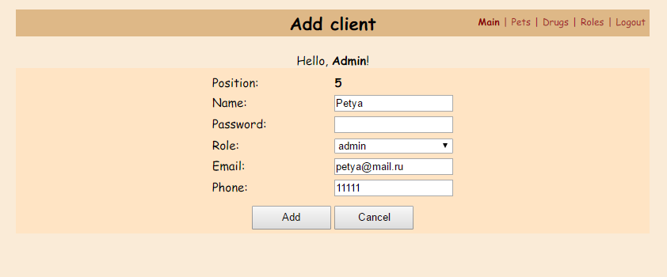
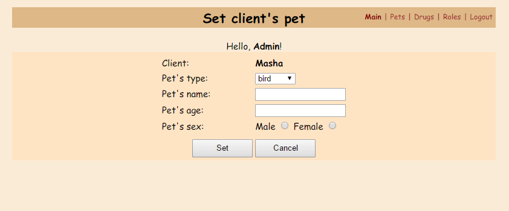

# Веб-версия клиники домашних питомцев

Мой вольный вариант веб-версии программы **"Клиника домашних питомцев"** из курса Петра Арсентьева
**"Java. Путь от ученика до эксперта"**.

Ссылка на сам курс: http://job4j.ru/courses/java_way_from_student_to_master.html

Для запуска нужно создать war-файл командой `mvn package`, а затем развернуть его на сервере *Apache Tomcat*.

Следует иметь ввиду, что сборка данного проекта зависит от базового проекта **"Клиника домашних питомцев"**, который
предварительно должен быть добавлен в локальный репозиторий maven командой `mvn install`.

Также для работы данного проекта необходима рабочая база данных MySQL, параметры которой настраиваются в файле
`src/main/resources/jdbc.properties`.

**Список клиентов с питомцами:**

**Добавление нового клиента:**

**Установка питомца клиенту:**

**Изменение имени клиента:**

**Изменение имени питомца:**

