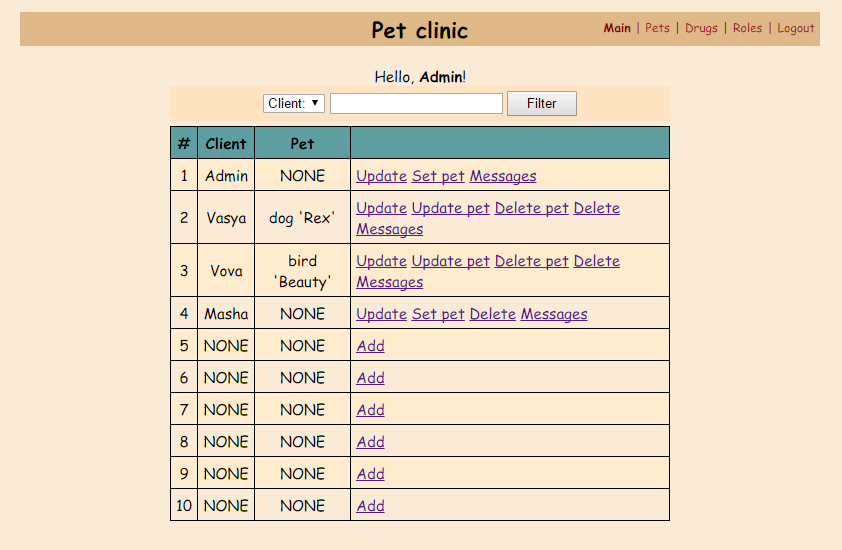
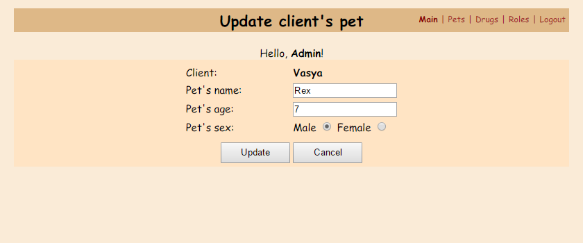
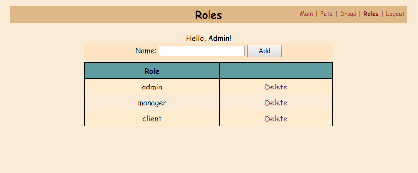

# Веб-версия клиники домашних питомцев

Мой вольный вариант веб-версии программы **"Клиника домашних питомцев"** из курса Петра Арсентьева
**"Java. Путь от ученика до эксперта"**.

Ссылка на сам курс: http://job4j.ru/courses/java_way_from_student_to_master.html

Для запуска нужно создать war-файл командой `mvn package`, а затем развернуть его на сервере *Apache Tomcat*.

Следует иметь ввиду, что сборка данного проекта зависит от базовых классов проекта **"Клиника домашних питомцев"**,
который предварительно должен быть добавлен в локальный репозиторий maven командой `mvn install`.

Также для работы необходима рабочая база данных MySQL, параметры которой настраиваются в файлах
`src/main/resources/jdbc.properties` и `src/main/resources/hibernate.cfg.xml`, а требуемая схема описана в файле
`sql/clinic.sql`, содержимое которого следует выполнить в клиенте mysql.

Перед первым запуском необходимо создать базу данных и заполнить ее первоначальными данными со
списком ролей и аккаунтом админа. Для этого следует запустить класс *InitTool* командой `mvn exec:java`.
Пароль клиента с именем *Admin* и правами администратора установлен равным *qwerty*, который затем после входа
можно сменить.

Всего в проекте предусмотрена поддержка трех ролей: *admin*, *manager* и *client*. Клиент может видеть только свои
данные и своего питомца, а менеджер может видеть и управлять всеми данными за исключением списка ролей и аккаунтов
админов. Админы же могут все.

**Список клиентов с питомцами:**

**Добавление нового клиента:**

**Установка питомца клиенту:**

**Обновление параметров клиента:**

**Обновление параметров питомца:**

**Список всех питомцев:**

**Лекарства в клинике:**

**Выдача лекарства питомцу клиента:**

**Роли:**

**Сообщения:**

**Логин:**

**Доступ запрещен:**

